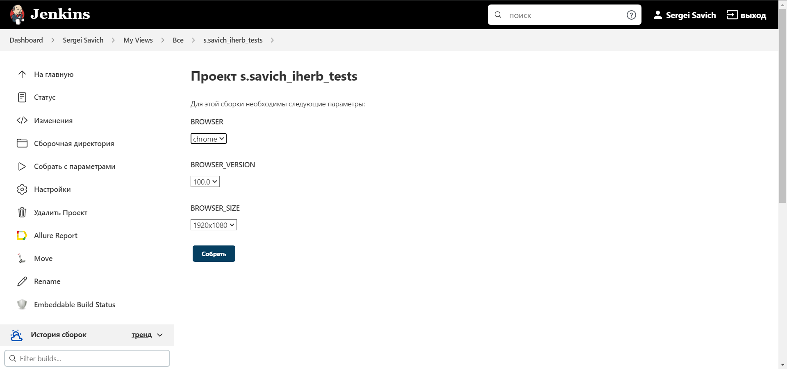
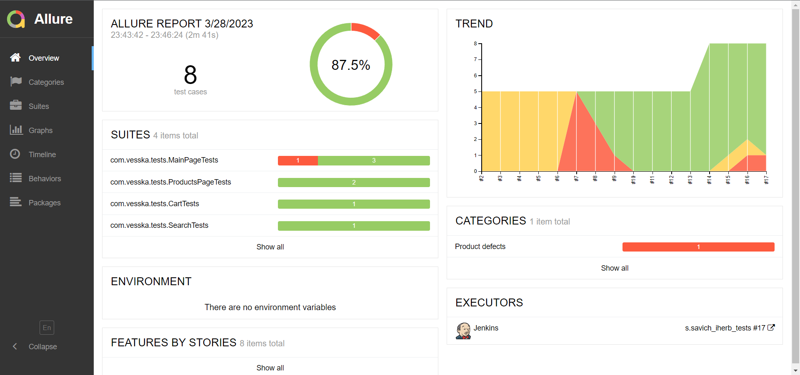
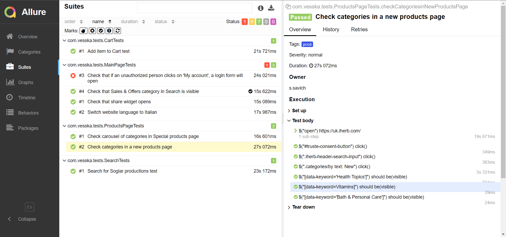
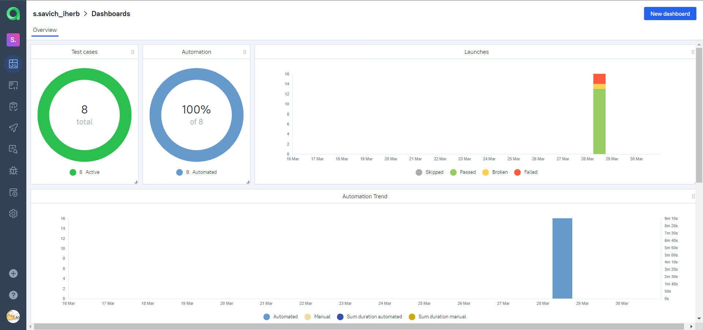
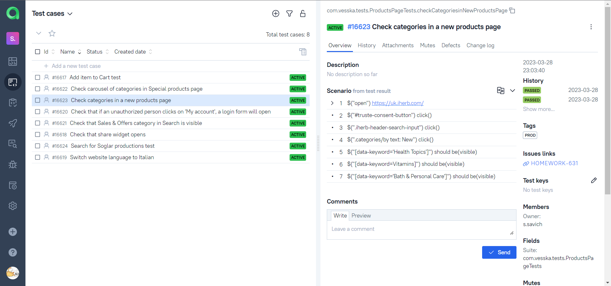
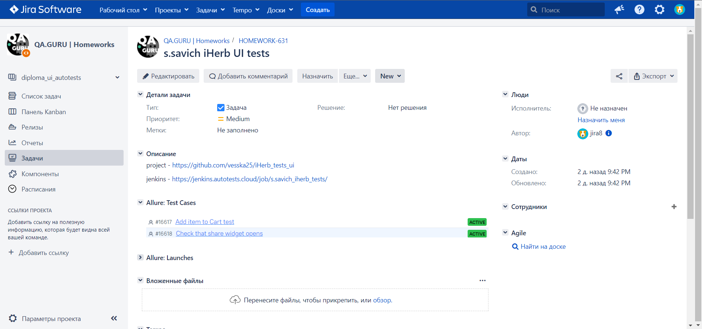
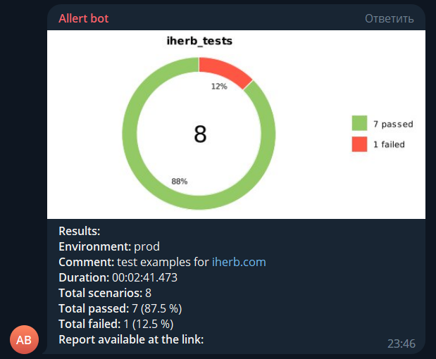

# UI Test automation project for [iHerb](https://www.iherb.com/)


> iHerb is an American e-commerce site that sells natural products, supplements, and herbs

# <a name="Technology">Tools and a technologies</a>
<p  align="center">
  <code></code>
  <code></code>
  <code></code>
  <code></code>
  <code></code>
  <code></code>
  <code></code>
  <code></code>
  <code></code>
  <code></code>
  <code></code>
  <code></code>
</p>

The autotests in this project are written in `Java` using `Selenide` framework.\
`Gradle` - is used as a build automation tool.  \
`JUnit5` - to execute tests.\
`Jenkins` - CI/CD for running tests remotely.\
`Selenoid` - to remote launching browsers in `Docker` containers.\
`Allure Report` - for test results visualisation.\
`Telegram Bot` - for test results notifications.\
`Allure TestOps` - as Test Management System.

# <a name="HowToRun">Autotest scenarios (UI)</a>

- [x] Switch website language to  another language (Italian)
- [x] Check categories in a new products page
- [x] Search for Soglar productions test
- [x] Add item to Cart test
- [x] Check carousel of categories in Special products page
- [x] Check that if an unauthorized person clicks on 'My account', a login form will open
- [x] Check that Sales & Offers category in Search is visible
- [x] Check that share widget opens

All Tests are designed with a Page Object pattern

# <a name="HowToRun">How to run</a>

## <a name="GradleCommand">Gradle command</a>
To run locally and in Jenkins the following command is used:
```bash
gradle clean test
```

To run with parameters:
```bash
clean
test
"-DselenoidUrl=${SELENOID_URL}"
"-DbrowserSize=${BROWSER_SIZE}"
"-Dbrowser=${BROWSER}"
"-DbrowserVersion=${BROWSER_VERSION}"
```

## <a name="RunInJenkins">Run in [Jenkins](https://jenkins.autotests.cloud/me/my-views/view/all/job/s.savich_iherb_tests/)</a>
Main page of the build:
<p  align="center">

</p>

A parametrized Jenkins job:
<p  align="center">

</p>

# <a name="AllureReport">Test results report in [Allure Report](https://jenkins.autotests.cloud/me/my-views/view/all/job/s.savich_iherb_tests/allure/)</a>

## Main page
Main page of Allure report contains the following blocks:

>- <code><strong>*ALLURE REPORT*</strong></code> - displays date and time of the test, overall number of launched tests, as well as a diagram indicating the percentage and number of successful, failed and broken tests during execution
>- <code><strong>*TREND*</strong></code> - displays trend of running tests for all runs
>- <code><strong>*SUITES*</strong></code> - displays distribution of tests by suites
>- <code><strong>*CATEGORIES*</strong></code> - displays distribution of unsuccessful tests by defect types
<p align="center">
  
</p>

## List of tests with steps and test artefacts
On the page the list of the tests grouped by suites with status shown for each test.\
Full info about each test can be shown: tags, severity, duration, detailed steps.

<p align="center">
  
</p>

# Allure TestOps integration


## <a name="AllureTestOpsProject">Project in Allure TestOps</a>
Test-cases in the project are imported and constantly updated from the code,
so there is no need in complex process of synchronization manual test-cases and autotests.\
It is enough to create and update an autotest in the code and the test-case in TMS always will be in actual state.\
Manual test-cases also can be added in TMS in case of need(via web interface or via code).

<p align="center">
  
</p>

<p align="center">
  
</p>

# Jira integration
<p align="center">
  
</p>

# <a name="TelegramNotifications">Telegram Notifications</a>
Telegram bot sends a brief report to a specified telegram chat by results of each build.
<p  align="center">

</p>

# Video of running tests
<p align="center">

</p>
